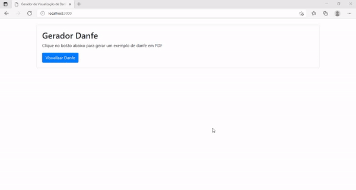

# Servidor Node JS com geração de Danfe em PDF

    

## *OBJETIVO :*
O projeto tem como finalidade transformar basicamente um objeto com caracteristicas da nota fiscal eletronica em um documento danfe de pdf

## *COMPONENTES EXTERNOS :*
+ **express**
+ **pdfkit**
## *COMPONENTES INTERNO :*

| Arquivo | Descritivo |
| ------ | ------ |
| DocumentoPDF.js |Esta classe tem como objetivo gerar um documento pdf com metodos pre facilitados, este metodos utilizam o package pdfkit para montar o pdf |
| Danfe.js | Esta classe tem como objetivo montar o documento pdf usando os metodos da classe documentosPDF.js |
| NotaFiscalEletronica.js | Esta classe basicamente se utiliza da classe danfe.js para passar os dados que efetivamente montarão o pdf da danfe |

## License

MIT

